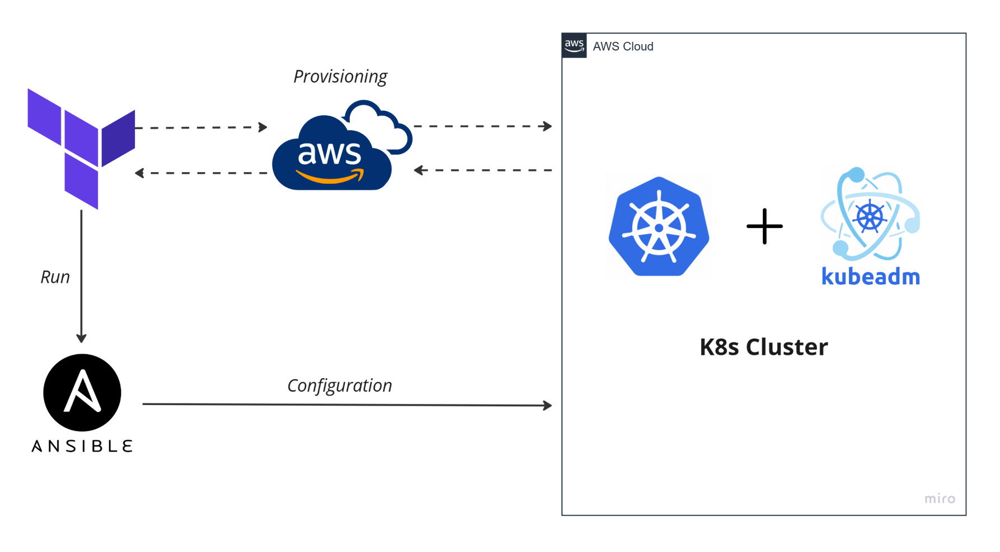
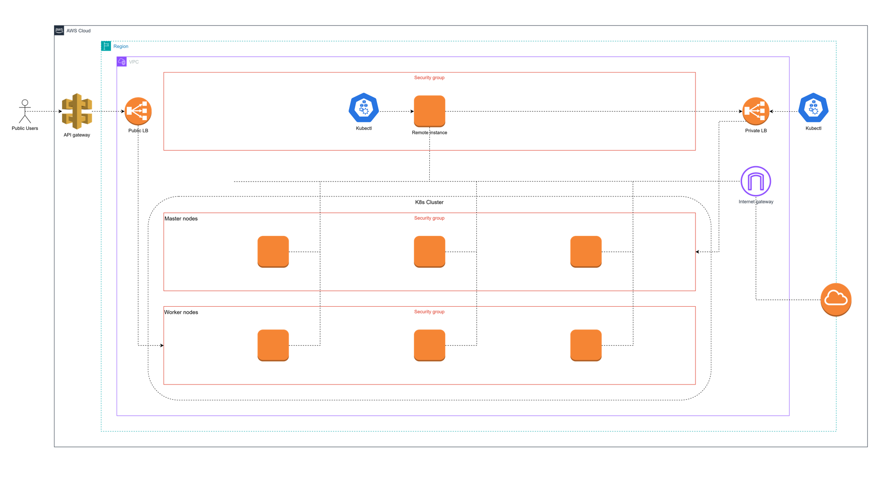

# Kubernetes Infrastructure Setup

## 🛈 Overview

This repo contains the source code for provisioning and configuration [Kubernetes](https://kubernetes.io/) infrastructure using [**Terraform**](https://www.terraform.io/) and [**Ansible**](https://www.ansible.com/). The setup involves deploying a K8s cluster on [**AWS**](https://aws.amazon.com/vi/) EC2 instances with load balancing and configuration management.

## 🧰 Components

1. **Terraform**:
    - Used for provisioning the AWS infrastructure.
    - Creates EC2 instances for Kubernetes master and worker nodes.
    - Set up the AWS Load Balancer for internal traffic balancing between master nodes.
    - Instantiates a virtual machine (remote host) with Ansible for configuring the K8s cluster.

2. **Ansible**:
    - Used for configuring Kubernetes cluster.
    - Deploys and configure [`kubeadm`](https://kubernetes.io/docs/reference/setup-tools/kubeadm/ "kubeadm") on the EC2 instances.
    - Manages the setup of Kubernetes master and worker nodes.

<br>

<p align="center">
    </img>
</p>

## 🌟 Kubernetes Infrastructure

- **Master nodes**:
    - 3 EC2 instances.
    - Load balanced internally by an AWS Load Balancer.
    - Handles cluster management and control plane operations.

- **Worker nodes**:
    - 3 EC2 instances.
    - Receives external traffics and runs application workloads.

- **Remote host**:
    - A virtual machine created and configured by Terraform.
    - Ensure that the `.kube` configuration is properly set up for accessing and managing the cluster.

<p align="center">
    </img>
</p>

## 🚀 Getting Started

### Prerequisites

- **AWS Account**: Ensure you have an [AWS account](https://signin.aws.amazon.com/signup?request_type=register) with the necessary permissions.
- **AWS CLI**: After installing [AWS CLI](https://docs.aws.amazon.com/cli/latest/userguide/getting-started-install.html), you need to configure authentication with AWS by providing `aws_access_key_id` & `aws_secret_access_key`.
&rarr; You can follow [this](https://docs.aws.amazon.com/IAM/latest/UserGuide/id_credentials_access-keys.html) to create your own access key.
- **Terraform**: Make sure you installed [Terraform](https://developer.hashicorp.com/terraform/install) to use the `terraform` command.

### Setup

1. **Clone the repository**:

```bash
git clone https://github.com/NT114-O21-DACN-DevOps/class-management-terraform-ansible
```

2. **Directory structure**:
- [`terraform/`](./terraform/): Contains Terraform configuration files.
- [`terraform/ansible`](./terraform/ansible/): Contains Ansible playbook.
- [`tarraform/templates`](./terraform/templates/): Contains a template file _(inventory)_ which will automatically fill the instances information for Ansible configuration.

3. **Configure Terraform**
- You should modify the Terraform configuration files to suit your AWS environment and requirements.
- Initialize and apply Terraform configuration:

```bash
cd terraform
terraform init
terraform apply
```

This will:
- Provision EC2 instances for Kubernetes.
- Set up the AWS load balancer.
- Instantiate a remote host.
- Automatically run Ansible playbook to configure the K8s cluster as a part of the provisioning process.

## Notes
- Ensure your AWS security groups and network configurations are set up to allow communication between instances as required.
- Review the Terraform and Ansible documentation for detailed instructions on configuration and usage.
